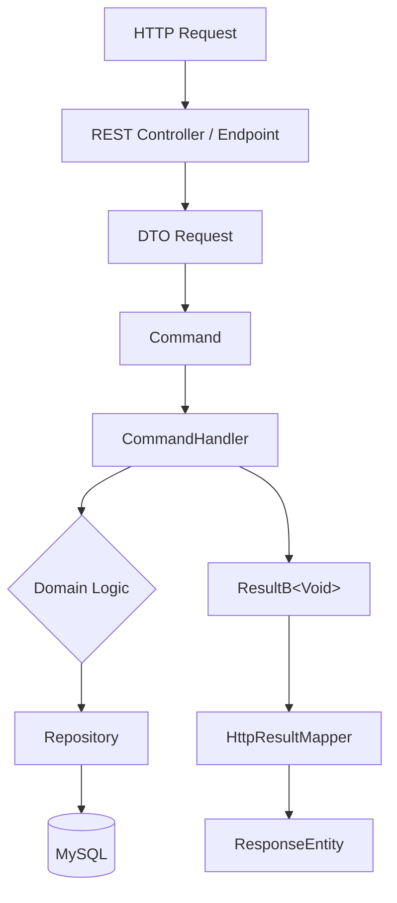
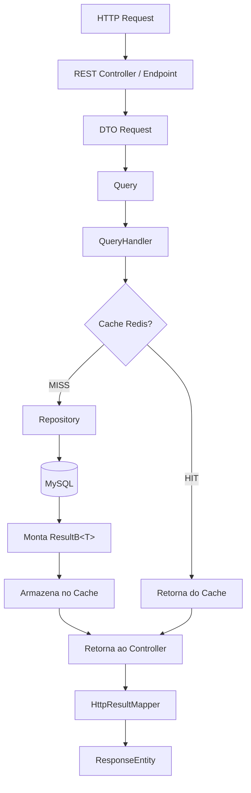
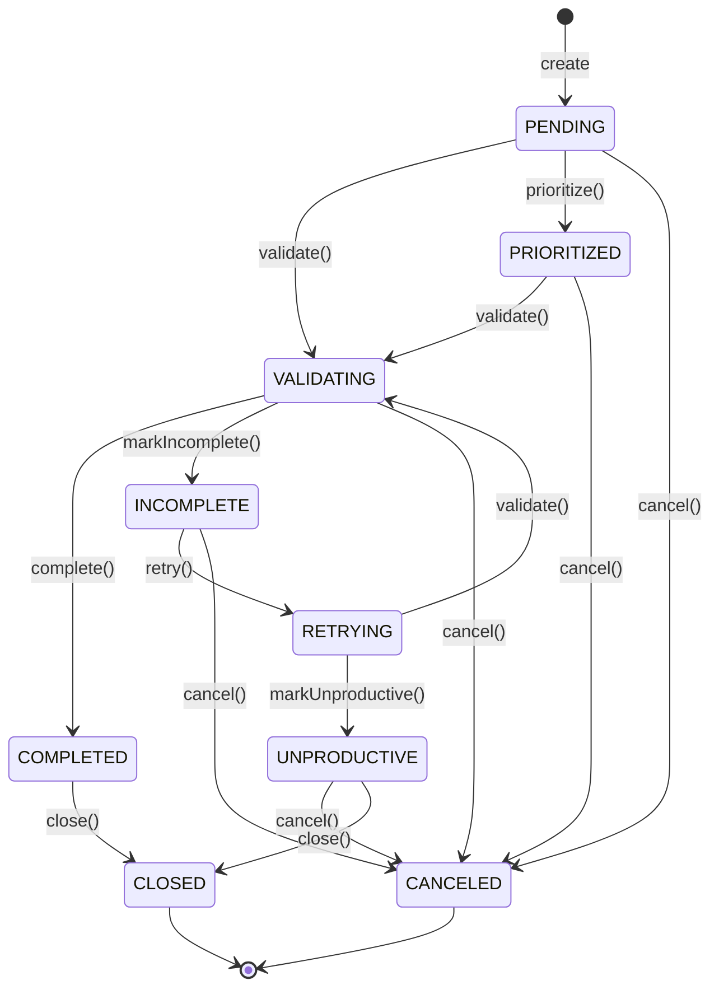

# Rising HelpDesk

Sistema de gerenciamento de chamados (tickets) desenvolvido com **Java 17 + Spring Boot 4**, arquitetura **CQRS**, cache distribuído via **Redis**, banco de dados **MySQL**, roteamento centralizado via **Spring Cloud Gateway**, e observabilidade com **Prometheus + Grafana**.

O frontend é uma SPA em **Angular 21** com **Server-Side Rendering (SSR)**.

---

## Índice

- [Visão Geral](#visão-geral)
- [Stack Tecnológica](#stack-tecnológica)
- [Arquitetura](#arquitetura)
  - [Diagrama Geral](#diagrama-geral)
  - [CQRS — Fluxo de Escrita (Command)](#cqrs--fluxo-de-escrita-command)
  - [CQRS — Fluxo de Leitura (Query com Cache)](#cqrs--fluxo-de-leitura-query-com-cache)
  - [Padrão State Machine no Ticket](#padrão-state-machine-no-ticket)
  - [Padrão Result (Short-Circuit)](#padrão-result-short-circuit)
  - [Arquitetura em Camadas (Ports & Adapters)](#arquitetura-em-camadas-ports--adapters)
- [Estrutura do Projeto](#estrutura-do-projeto)
- [Funcionalidades](#funcionalidades)
  - [Tickets](#tickets)
  - [Filas (Queues)](#filas-queues)
- [Configuração via .env](#configuração-via-env)
- [Rodando com Docker](#rodando-com-docker)
- [Rodando Localmente (sem Docker)](#rodando-localmente-sem-docker)
- [Observabilidade](#observabilidade)
- [Testes](#testes)
- [API — Endpoints](#api--endpoints)
- [Decisões de Design](#decisões-de-design)

---

## Visão Geral

O Rising HelpDesk é um sistema de suporte técnico que permite:

- Criar e gerenciar **chamados (tickets)** com ciclo de vida completo controlado por **State Machine**
- Organizar tickets em **filas** por área e subárea
- Registrar **interações** e **menções** em cada ticket
- Realizar buscas com **paginação**, por ID, número, autor ou fila
- Expor **métricas** de performance via Actuator + Prometheus

---

## Stack Tecnológica

| Camada            | Tecnologia                                        | Versão    |
|-------------------|---------------------------------------------------|-----------|
| Linguagem         | Java                                              | 17        |
| Framework API     | Spring Boot                                       | 4.0.6     |
| Gateway           | Spring Cloud Gateway (WebFlux)                    | 2025.1.1  |
| Persistência      | Spring Data JPA + MySQL Connector                 | 8.4.0     |
| Cache             | Spring Data Redis                                 | —         |
| ID geração        | JNanoId                                           | 2.0.0     |
| Utilitários       | Lombok, Apache Commons Lang3                      | —         |
| Métricas          | Micrometer + Prometheus Registry                  | —         |
| Banco de Dados    | MySQL                                             | 8.4       |
| Cache In-Memory   | Redis                                             | 7         |
| Observabilidade   | Prometheus + Grafana                              | latest    |
| Frontend          | Angular + Angular Material + Bootstrap            | 21        |
| Frontend SSR      | @angular/ssr + Express                            | 21        |
| Testes (API)      | JUnit 5 + Mockito + Testcontainers (MySQL)        | —         |
| Contêineres       | Docker + Docker Compose                           | —         |

---

## Arquitetura

### Diagrama Geral

```
┌─────────────┐        ┌─────────────────────────────────────────────────┐
│  Angular    │        │                  Docker Network                  │
│  (SSR/SPA)  │        │                                                  │
│  :4200      │──────▶ │  Gateway (:8080)                                 │
└─────────────┘        │     │                                            │
                       │     ▼                                            │
                       │  API Spring Boot (:8001)                         │
                       │     │                 │                          │
                       │     ▼                 ▼                          │
                       │  MySQL (:3306)    Redis (:6379)                  │
                       │                                                  │
                       │  Prometheus (:9090) ◀── Scrape /actuator/prometheus
                       │     │                                            │
                       │     ▼                                            │
                       │  Grafana (:3000)                                 │
                       └─────────────────────────────────────────────────┘
```

### CQRS — Fluxo de Escrita (Command)

Toda operação que **modifica estado** passa por um `Command`, processado por um `CommandHandler`, que opera exclusivamente na camada de domínio e persiste via repositório.



**Contratos:**
- `Command` — interface marcadora para todos os comandos
- `CommandHandler<C extends Command>` — interface com `ResultB<Void> handle(C cmd)`
- Retorno sempre encapsulado em `ResultB<Void>` (short-circuit)

**Comandos implementados:**

| Comando                   | Descrição                         |
|---------------------------|-----------------------------------|
| `CreateTicket`            | Cria um novo ticket               |
| `CloseTicket`             | Fecha o ticket                    |
| `AddInteractionToTicket`  | Adiciona uma interação ao ticket  |
| `AddTicketMention`        | Menciona um usuário no ticket     |
| `RemoveTicketMention`     | Remove uma menção do ticket       |
| `ChangeTicketQueue`       | Redireciona ticket para outra fila|
| `CreateQueue`             | Cria uma nova fila                |
| `RemoveQueue`             | Remove uma fila                   |
| `ChangeQueueArea`         | Altera a área da fila             |
| `ChangeQueueSubarea`      | Altera a subárea da fila          |

---

### CQRS — Fluxo de Leitura (Query com Cache)

Toda operação de **leitura** passa por uma `Query`, processada por um `QueryHandler`, com camada de **Cache-Aside via Redis**.



**Cache-Aside:**
- Tecnologia: Redis 7
- TTL padrão: **30 minutos**
- Serialização customizada via `ResultRedisSerializer`
- Anotação `@Cacheable` aplicada nos `QueryHandler`s de leitura

**Queries implementadas:**

| Query                       | Descrição                              |
|-----------------------------|----------------------------------------|
| `FindTicketById`            | Busca ticket por UUID (com cache)      |
| `FindTicketByNumber`        | Busca ticket por número único          |
| `FindTicketsByAuthor`       | Lista tickets de um autor com paginação|
| `FindTicketsByPagination`   | Lista todos os tickets paginados       |
| `FindQueueById`             | Busca fila por UUID                    |
| `FindQueueByArea`           | Lista filas por área                   |
| `FindQueueByAuthor`         | Lista filas criadas por um autor       |
| `FindQueueByPagination`     | Lista todas as filas paginadas         |

---

### Padrão State Machine no Ticket

O ciclo de vida do ticket é gerenciado pelo padrão **State**, onde cada estado encapsula as transições permitidas. Isso evita condicionais espalhados e garante que transições inválidas sejam rejeitadas no domínio.



**Estados disponíveis:**

| Status         | Descrição                                              |
|----------------|--------------------------------------------------------|
| `PENDING`      | Ticket recém-criado, aguardando atendimento            |
| `VALIDATING`   | Em análise pelo suporte                                |
| `COMPLETED`    | Solução entregue, aguardando fechamento                |
| `INCOMPLETE`   | Solução incompleta, requer mais informações            |
| `RETRYING`     | Retentativa de resolução                               |
| `UNPRODUCTIVE` | Sem progresso, candidato a cancelamento                |
| `PRIORITIZED`  | Marcado como prioritário                               |
| `CANCELED`     | Cancelado                                              |
| `CLOSED`       | Encerrado definitivamente                              |

---

### Padrão Result (Short-Circuit)

Toda operação de domínio retorna um `ResultB<T>` — uma mônada inspirada em Railway-Oriented Programming. Isso elimina exceções de fluxo de negócio e garante composição segura de operações.

```mermaid
flowchart LR
    A[ResultB.create()] -->|flatMap| B{Sucesso?}
    B -->|Sim| C[Próxima operação]
    B -->|Não - DomainError| D[Short-Circuit: pula demais]
    C -->|flatMap| E{Sucesso?}
    E -->|Sim| F[ResultB com valor]
    E -->|Não| D
    D --> G[ResultB com erro]
```

**API principal:**

```java
ResultB.create()                   // Inicia vazio (Void)
  .flatMap(() -> /* operação */)   // Encadeia; para se houver erro
  .map(value -> transform(value))  // Transforma o valor
  .mapIfError(err -> log(err));    // Trata erro sem propagar

ResultB.of(value)                  // Cria com valor
ResultB.error(new DomainError(..)) // Cria com erro
ResultB.empty()                    // Cria vazio (Void ok)
```

`HttpResultMapper` converte o `ResultB<T>` final em `ResponseEntity<?>` automaticamente.

---

### Arquitetura em Camadas (Ports & Adapters)

O módulo `ticket` segue uma variação de **Arquitetura Hexagonal**, com separação clara entre domínio, adaptadores e features verticais.

```
ticket/
├── domain/                  ← Núcleo de negócio (sem dependências externas)
│   ├── ticket/
│   │   ├── Ticket.java      ← Aggregate Root
│   │   ├── entities/        ← Queue, Interaction, Mention
│   │   ├── state/           ← State Machine (TicketState + 9 implementações)
│   │   ├── status/          ← Enum TicketStatus
│   │   └── valueObjects/    ← TicketNumber (NanoId)
│   ├── repository/          ← Interfaces de repositório (Ports)
│   └── valueObjects/
│
├── features/                ← Casos de uso organizados verticalmente
│   ├── ticket/
│   │   ├── create_ticket/   ← Endpoint + Command + Handler + Service
│   │   ├── close_ticket/
│   │   ├── find_ticket_by_id/
│   │   └── ...
│   └── queue/
│       ├── create_queue/
│       └── ...
│
├── adapters/                ← Implementações (Adapters)
│   └── database/
│       ├── jpa/             ← Repositórios Spring Data JPA
│       ├── entities/        ← Entidades JPA (@Entity)
│       ├── mappers/         ← Mapeamento domínio ↔ entidade JPA
│       └── *RepositoryImpl  ← Implementações das interfaces de domínio
│
├── application/             ← DTOs de saída (TicketDetails, QueueDetails)
│
└── infrastructure/          ← Configurações técnicas
    ├── configs/             ← RedisConfig, StubAuthenticatedUser
    └── serializer/cache/    ← ResultRedisSerializer
```

---

## Estrutura do Projeto

```
Rising-HelpDesk/
├── RisingHelpdesk/          ← API principal (Spring Boot 4 + Java 17)
│   ├── src/main/java/
│   │   └── io/github/jvondoellinger/risinghelpdesk/
│   │       ├── RisingApplication.java
│   │       ├── shared/      ← CQRS, ResultB, utilitários compartilhados
│   │       └── ticket/      ← Módulo de tickets (domain, features, adapters)
│   ├── src/main/resources/
│   │   └── application-dev.properties
│   ├── Dockerfile
│   └── pom.xml
│
├── gateway/                 ← Spring Cloud Gateway
│   ├── src/main/resources/application.properties
│   ├── Dockerfile
│   └── pom.xml
│
├── frontend/
│   └── tickets/             ← Angular 21 SPA (SSR habilitado)
│       └── src/app/
│           ├── features/    ← Serviços de integração com a API
│           ├── components/  ← Navbar, Card, CreateTicketModal
│           └── pages/       ← Home, CardGrid
│
├── docker/
│   ├── docker-compose.yaml  ← Orquestração de todos os serviços
│   └── prometheus/
│       └── prometheus.yml
│
├── .env.example             ← Variáveis de ambiente (copie para .env)
├── start.sh                 ← Script de inicialização
└── README.md
```

---

## Funcionalidades

### Tickets

- **Criar ticket** com título, fila de destino e prazo
- **Fechar ticket** — transição de estado gerenciada pela State Machine
- **Adicionar interação** — registro de ações/comentários no ticket
- **Mencionar usuário** — adicionar/remover menções no ticket
- **Mudar fila** — redirecionar ticket para outra área/subárea
- **Buscar por ID** — com cache Redis automático (TTL 30min)
- **Buscar por número** — número único gerado via NanoId
- **Listar por autor** — paginado
- **Listar todos** — paginado

### Filas (Queues)

- **Criar fila** com área e subárea
- **Remover fila**
- **Alterar área** ou **subárea** de uma fila
- **Buscar por ID**, por área, por autor
- **Listar com paginação**

---

## Configuração via .env

Copie o arquivo de exemplo e preencha com suas credenciais:

```bash
cp .env.example .env
```

### Variáveis disponíveis

```dotenv
# ── MySQL ──────────────────────────────────────────────────────────────────
MYSQL_ROOT_PASSWORD=root_password_change_me   # Senha do root
MYSQL_DATABASE=RisingHelpDeskDB               # Nome do banco criado
MYSQL_USER=helpdesk                           # Usuário da aplicação
MYSQL_PASSWORD=helpdesk_password_change_me    # Senha do usuário

# ── API (porta 8001) ────────────────────────────────────────────────────────
API_PORT=8001
SPRING_PROFILES_ACTIVE=dev
SPRING_DATASOURCE_URL=jdbc:mysql://mysql:3306/RisingHelpDeskDB?createDatabaseIfNotExist=true
SPRING_DATASOURCE_USERNAME=helpdesk
SPRING_DATASOURCE_PASSWORD=helpdesk_password_change_me
SPRING_JPA_DDL_AUTO=update                    # update | create | none
SPRING_JPA_SHOW_SQL=false
SPRING_REDIS_HOST=redis
SPRING_REDIS_PORT=6379

# ── Gateway (porta 8080) ────────────────────────────────────────────────────
GATEWAY_PORT=8080
API_INTERNAL_URL=http://api:8001              # Nome do serviço interno no Docker

# ── Redis ───────────────────────────────────────────────────────────────────
REDIS_PORT=6379

# ── Prometheus ──────────────────────────────────────────────────────────────
PROMETHEUS_PORT=9090
PROMETHEUS_TARGET=api:8001

# ── Grafana ─────────────────────────────────────────────────────────────────
GRAFANA_PORT=3000
GRAFANA_ADMIN_USER=admin
GRAFANA_ADMIN_PASSWORD=admin_password_change_me
```

> **Importante:** Nunca comite o arquivo `.env` com senhas reais. O `.gitignore` já o exclui por padrão.

---

## Rodando com Docker

### Pré-requisitos

- [Docker](https://docs.docker.com/get-docker/) ≥ 24
- [Docker Compose](https://docs.docker.com/compose/install/) v2 (plugin) ou v1 standalone

### 1. Clonar e configurar

```bash
git clone https://github.com/jvondoellinger/Rising-HelpDesk.git
cd Rising-HelpDesk

cp .env.example .env
# Edite .env com suas senhas
nano .env
```

### 2. Iniciar todos os serviços

```bash
./start.sh start
```

O script irá:
1. Verificar se Docker e Docker Compose estão instalados
2. Criar `.env` automaticamente a partir de `.env.example` caso não exista
3. Fazer pull das imagens necessárias
4. Fazer build das imagens da API e Gateway
5. Subir todos os containers em ordem correta (aguardando healthchecks)

### 3. Verificar status

```bash
./start.sh status
```

### 4. Outros comandos

```bash
./start.sh logs       # Acompanhar logs em tempo real
./start.sh stop       # Parar todos os serviços
./start.sh restart    # Reiniciar todos os serviços
```

### Serviços após a inicialização

| Serviço       | URL                          | Credenciais          |
|---------------|------------------------------|----------------------|
| Gateway       | http://localhost:8080        | —                    |
| API (direto)  | http://localhost:8001        | —                    |
| API Health    | http://localhost:8001/actuator/health | —           |
| API Métricas  | http://localhost:8001/actuator/prometheus | —        |
| Prometheus    | http://localhost:9090        | —                    |
| Grafana       | http://localhost:3000        | admin / (seu .env)   |
| MySQL         | localhost:3306               | conforme .env        |
| Redis         | localhost:6379               | —                    |

---

## Rodando Localmente (sem Docker)

### Pré-requisitos

- Java 17+
- Maven 3.9+
- MySQL 8.4 rodando localmente
- Redis 7 rodando localmente

### API Principal

```bash
cd RisingHelpdesk

# Configure application-dev.properties com seus endereços locais
# src/main/resources/application-dev.properties

./mvnw spring-boot:run -Dspring-boot.run.profiles=dev
```

### Gateway

```bash
cd gateway
./mvnw spring-boot:run
```

### Frontend (Angular)

```bash
cd frontend/tickets
npm install
npm start               # Dev server em http://localhost:4200
# ou
npm run build           # Build de produção
```

---

## Observabilidade

### Prometheus

Coleta métricas da API a cada 5 segundos via endpoint `/actuator/prometheus`.

Acesse: http://localhost:9090

Exemplos de queries:
```promql
# Taxa de requisições por segundo
rate(http_server_requests_seconds_count{application="rising_helpdesk"}[1m])

# Latência p95
histogram_quantile(0.95, rate(http_server_requests_seconds_bucket[5m]))

# JVM Heap usado
jvm_memory_used_bytes{area="heap"}
```

### Grafana

Acesse: http://localhost:3000

Configurar datasource:
1. Vá em **Connections > Data Sources > Add data source**
2. Selecione **Prometheus**
3. URL: `http://prometheus:9090`
4. Clique em **Save & Test**

Dashboards recomendados (importar pelo ID):
- **JVM Micrometer** — ID `4701`
- **Spring Boot Statistics** — ID `12685`

### Spring Actuator

Endpoints expostos:

| Endpoint                          | Descrição                  |
|-----------------------------------|----------------------------|
| `/actuator/health`                | Status da aplicação        |
| `/actuator/metrics`               | Métricas disponíveis       |
| `/actuator/prometheus`            | Métricas no formato Prometheus |
| `/actuator/info`                  | Informações da aplicação   |

---

## Testes

A API utiliza **JUnit 5 + Mockito + Testcontainers** para testes de integração com MySQL real em container.

```bash
cd RisingHelpdesk

# Executar todos os testes
./mvnw test

# Testes com relatório
./mvnw test jacoco:report
```

> Os testes de integração com Testcontainers sobem um container MySQL automaticamente — é necessário ter o Docker rodando.

Para testes unitários puros, usa-se **H2 in-memory** configurado no escopo `test`.

---

## API — Endpoints

Todos os endpoints são acessíveis via **Gateway** em `http://localhost:8080/ticket/*`  
ou diretamente na API em `http://localhost:8001/api/ticket/*`.

### Tickets

| Método   | Path                                          | Descrição                              |
|----------|-----------------------------------------------|----------------------------------------|
| `POST`   | `/api/ticket`                                 | Criar ticket                           |
| `GET`    | `/api/ticket/{id}`                            | Buscar ticket por ID                   |
| `GET`    | `/api/ticket/number/{number}`                 | Buscar ticket por número               |
| `GET`    | `/api/ticket/author/{authorId}`               | Listar tickets por autor (paginado)    |
| `GET`    | `/api/ticket/pagination`                      | Listar todos os tickets (paginado)     |
| `PATCH`  | `/api/ticket/{id}/close`                      | Fechar ticket                          |
| `POST`   | `/api/ticket/{id}/interaction`                | Adicionar interação                    |
| `POST`   | `/api/ticket/{id}/mention`                    | Adicionar menção                       |
| `DELETE` | `/api/ticket/{id}/mention/{mentionId}`        | Remover menção                         |
| `PATCH`  | `/api/ticket/{id}/queue`                      | Alterar fila do ticket                 |

### Filas (Queues)

| Método   | Path                                          | Descrição                              |
|----------|-----------------------------------------------|----------------------------------------|
| `POST`   | `/api/ticket/queue`                           | Criar fila                             |
| `DELETE` | `/api/ticket/queue/{id}`                      | Remover fila                           |
| `GET`    | `/api/ticket/queue/{id}`                      | Buscar fila por ID                     |
| `GET`    | `/api/ticket/queue/area/{area}`               | Listar filas por área                  |
| `GET`    | `/api/ticket/queue/author/{authorId}`         | Listar filas por autor                 |
| `GET`    | `/api/ticket/queue/pagination`                | Listar todas as filas (paginado)       |
| `PATCH`  | `/api/ticket/queue/{id}/area`                 | Alterar área da fila                   |
| `PATCH`  | `/api/ticket/queue/{id}/subarea`              | Alterar subárea da fila                |

### Exemplo de payload — Criar Ticket

```json
POST /api/ticket
Content-Type: application/json

{
  "title": "Erro ao acessar o sistema de RH",
  "queueId": "3f8e1c4a-5d2b-4a6e-b9f7-1e2c3d4a5b6c",
  "deadline": "2026-09-01T10:00:00"
}
```

### Exemplo de payload — Criar Fila

```json
POST /api/ticket/queue
Content-Type: application/json

{
  "area": "Infraestrutura",
  "subarea": "Redes"
}
```

---

## Decisões de Design

### CQRS com CommandBus/QueryBus implícito

Em vez de um bus centralizado com registro dinâmico de handlers, o projeto adota **injeção direta de handlers por interface tipada**. Isso simplifica o grafo de dependências mantendo a semântica de CQRS: cada feature tem seu próprio par Command/Handler ou Query/Handler, com responsabilidade única e coesão máxima.

### State Machine no domínio

O ciclo de vida do ticket usa o padrão **State** (GoF) diretamente no agregado `Ticket`. Cada estado é uma classe concreta que implementa `TicketState`, definindo quais transições são permitidas. Isso concentra as regras de transição no domínio — sem `if/switch` espalhados — e facilita adicionar novos estados sem modificar o agregado.

### ResultB — Railway-Oriented Programming

`ResultB<T>` é uma mônada de resultado que elimina exceções como mecanismo de fluxo de negócio. Operações encadeadas com `flatMap` param automaticamente no primeiro erro (`DomainError`), sem precisar de try/catch em cada nível. Isso torna o fluxo de negócio legível, previsível e testável.

### Cache-Aside com TTL de 30 minutos

O padrão Cache-Aside foi escolhido por ser o mais adequado para leituras frequentes com dados que não mudam a cada segundo. A serialização customizada (`ResultRedisSerializer`) garante que os `ResultB<T>` sejam corretamente armazenados e recuperados do Redis, preservando a semântica de erro/sucesso.

### Arquitetura por feature (Vertical Slice)

As features são organizadas em diretórios verticais (`create_ticket`, `find_ticket_by_id`, etc.), cada um contendo todos os artefatos necessários: Endpoint, Command/Query, Handler e Service. Isso maximiza a coesão e facilita localizar, modificar ou remover uma feature inteira sem tocar em outras.

### NanoId como identificador de ticket

`TicketNumber` usa **JNanoId** para gerar IDs curtos, legíveis e únicos que servem como número de chamado amigável (ex: `V1StGXR8_Z5jdHi6B-myT`), complementando o UUID interno.

### Spring Cloud Gateway como único ponto de entrada

O Gateway centraliza o roteamento, facilitando adicionar autenticação, rate limiting, circuit breaker e load balancing no futuro sem modificar a API interna.

---

## Autor

**Jorge Von Doellinger** — [@jvondoellinger](https://github.com/jvondoellinger)

Projeto desenvolvido com foco em:
- Arquitetura limpa e separação de responsabilidades
- Performance com cache distribuído
- Escalabilidade e extensibilidade
- Boas práticas de engenharia de software
